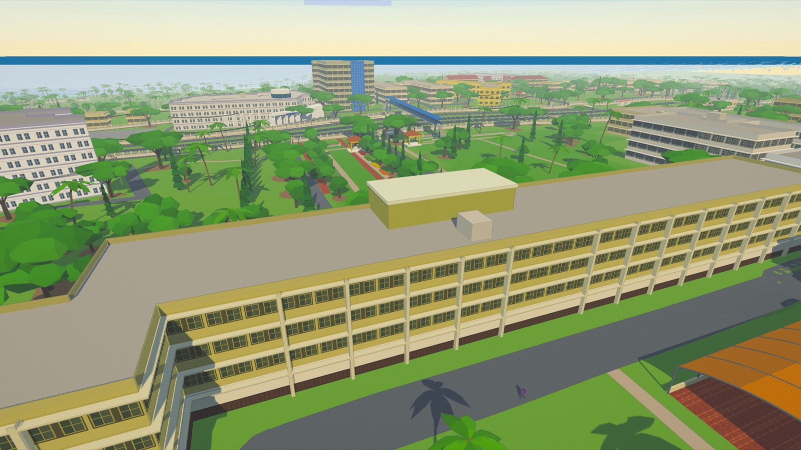
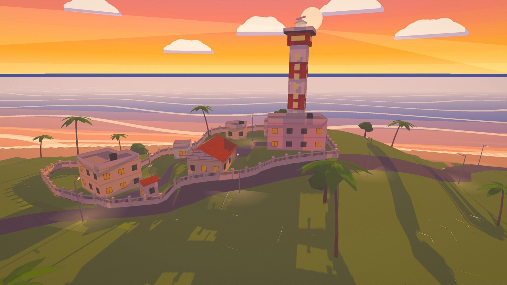
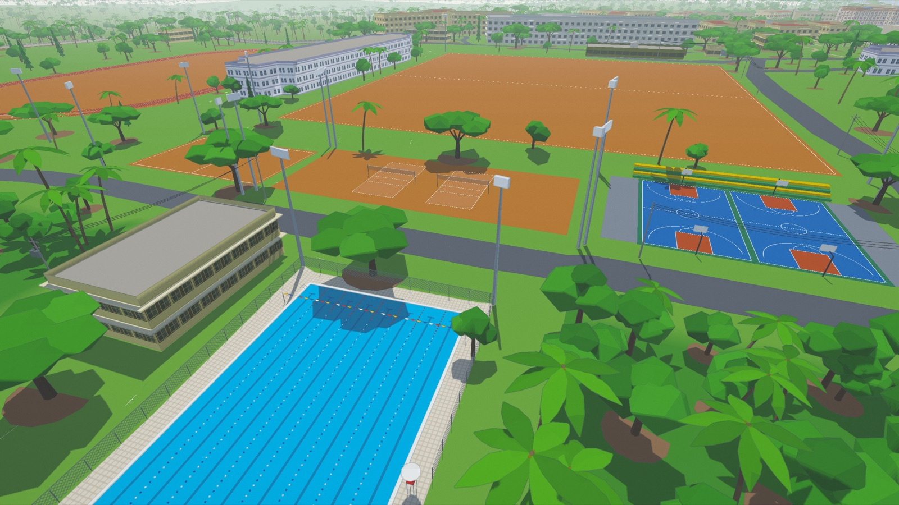
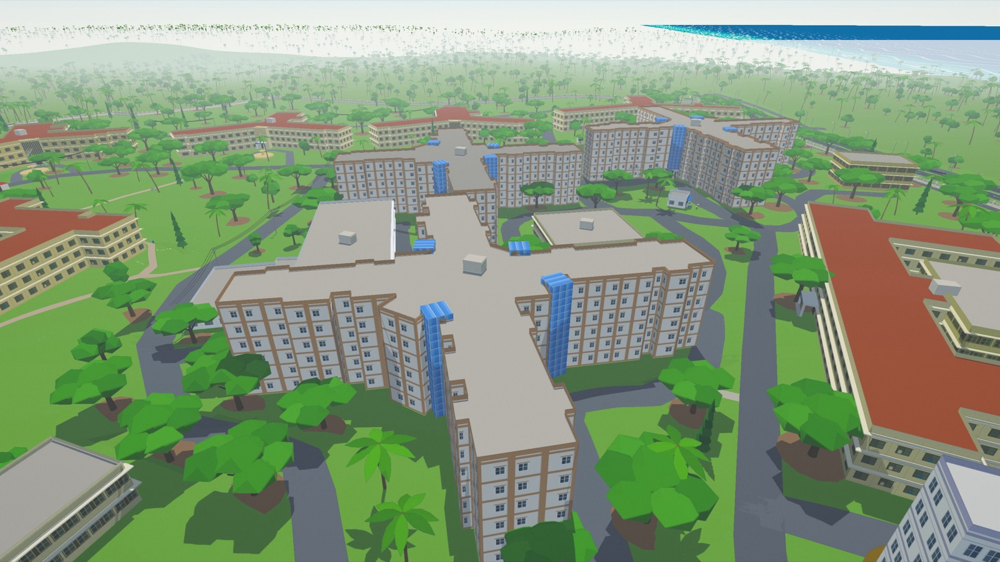
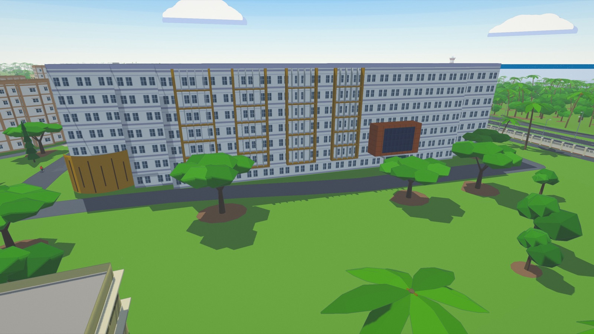
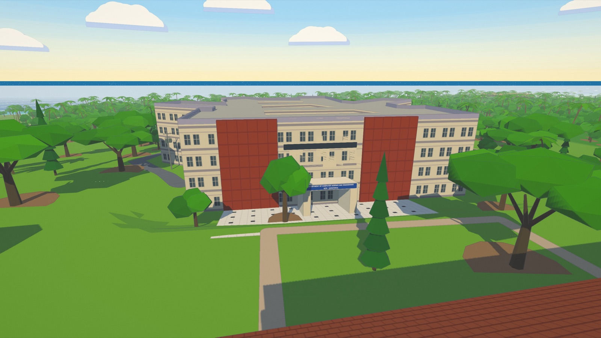

# NITK: Fresher Year

A *Bully*-style college game set on the real NITK Surathkal campus, built in the browser from OpenStreetMap data. Walk, cycle or fly over the campus, or play through your fresher year: messes, classes, clubs, fests, the monsoon, and the sunset from the lighthouse hill. Nobody gets hurt; the missions are ordinary college challenges.

**Play:** https://nitk-world.vercel.app



| | |
|---|---|
|  |  |
|  |  |
|  |  |
|  |  |

## What's in it

- **The real campus, 1:1.** Every road, building, ground and tree from OpenStreetMap, on real terrain (SRTM/ASTER elevation), with NH66, its underpasses and the foot overbridge, the beach and the lighthouse. Key buildings are matched to photographs of the campus.
- **Two modes.** *Explore* is free roam, with walk-in interiors, a map with teleport, a drone view, and season and weather pickers. *Story* is chapters of missions (Chapters 1 and 2 are playable), plus classes, campus jobs, a journal and a yearbook.
- **Life on campus.** Students on the footpaths, cyclists, dogs, the odd peacock, a day clock with classes and curfew, seasons, festivals, and synthesized music and ambience.
- **Everything is generated in code.** There are no models, textures or audio files to download. It uses a cel-shaded look with soft coloured outlines.

## Setup

```bash
npm install
npm run dev              # http://localhost:5173
```

```bash
npm run typecheck
npm run build                          # Explore mode only
VITE_STORY_MODE=true npm run build     # with Story mode
```

Dev shortcuts: `?explore` goes straight into Explore, `?autostart` skips the title, `?skipto=<mission-id>` starts just before a mission. `window.nitk` exposes the game in the console.

The OSM extract and terrain ship in `public/data/`. Refresh them with `npm run osm:fetch` and `npm run dem:fetch`.

## Controls

| | |
|---|---|
| `W A S D` | walk (`Shift` run, `Space` jump) |
| `E` | talk, interact, get on or off your cycle |
| `M` | map, search and teleport |
| `F` | drone view (`Space` / `C` to climb or descend) |
| `J` / `Y` | journal / yearbook |
| `B` | cycle bell |
| `T` | skip the clock ahead |
| `N` | next music track |
| drag / wheel | look around / zoom |

On touch screens, the left half is a joystick and the right half looks around.

## Contributing to the campus

- Better OSM data (`building:levels`, `roof:colour`, `name`) improves the world directly.
- Per-building looks from photos live in `src/world/archetypes.ts` and `src/world/landmarks.ts`.
- `public/data/overrides.json` overrides any building by OSM id.
- Game research and the plan for later chapters are in [`docs/GAME_BIBLE.md`](docs/GAME_BIBLE.md).

## Credits

- Map data © [OpenStreetMap](https://www.openstreetmap.org/copyright) contributors, ODbL 1.0.
- Elevation: SRTM (NASA/USGS) and ASTER GDEM (NASA/METI), via [OpenTopoData](https://www.opentopodata.org/).
- The cel pipeline, hero rig and map style are ported from [SADAK](https://github.com/mittal-parth/sadak), which adapted the shading from [sakura-crossing](https://github.com/Kenton-GMI/sakura-crossing) (MIT, © 2026 Kenton Wang).
- The street detail (poles, wires, props) is inspired by [sakuragaoka-station](https://github.com/Kenton-GMI/sakuragaoka-station) (MIT, © 2026 Kenton Wang).
- Building references: photographs of the campus and NITK's [virtual tour](https://vtour.nitk.ac.in/).
- Icons: [Lucide](https://lucide.dev). Fonts: Raleway and Noto Sans, from Google Fonts.
- Built with [three.js](https://threejs.org) and Vite.
