# NITK: Fresher Year

A *Bully*-style college game set on the real NITK Surathkal campus, built from OpenStreetMap data. Nobody gets hurt: the missions are ordinary college challenges. It runs in the browser.

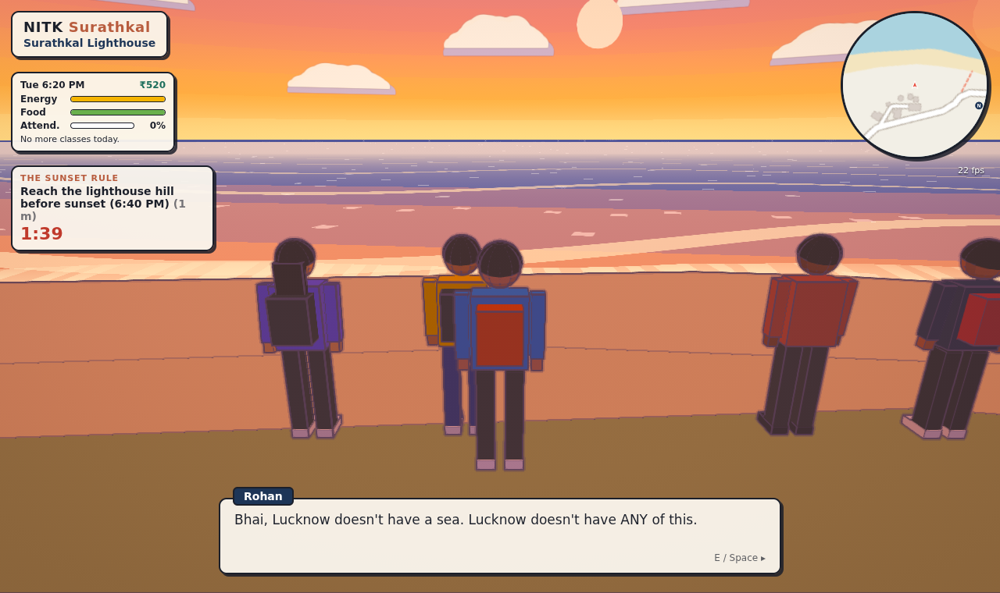

It follows [SADAK](https://github.com/mittal-parth/sadak)'s approach: the whole world is generated in code from an OSM extract (no models, no textures to download), and it uses SADAK's cel-shaded look with toon ramps, tinted shadows and an ink-line pass.

```bash
npm install
npm run dev          # http://localhost:5173
```

## Two modes

- **Story Mode:** your fresher year, told in chapters of missions (below).
- **Explore Mode:** free roam of the real campus, view-only. Walk into the Main Building, Central Library, SJA, Mega Mess, Night Canteen and LHC-A. The season picker and rain toggle are there to check the campus across the year.

Story Mode is behind a build flag so a deploy can ship Explore Mode alone:

```bash
npm run build                          # production: Explore only
VITE_STORY_MODE=true npm run build     # production with Story Mode
npm run dev                            # dev: Story Mode on (VITE_STORY_MODE=false to hide it)
```

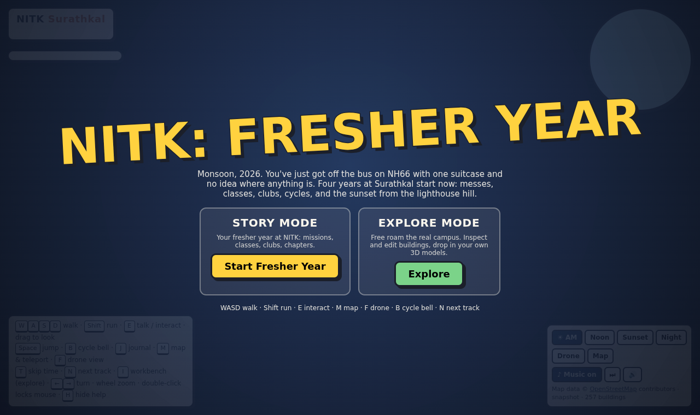

## Seasons, days and the schedule

The story isn't pinned to calendar dates; you can wander for a week if you like. Days count up as you sleep ("Day 3, Wednesday"), and **the season follows the chapter**:

| Season | Chapter | What changes |
|---|---|---|
| **Monsoon** | 1, Srinivasnagar | frequent rain spells, lush green, grey skies, rough sea, umbrellas everywhere, frogs at night |
| **Post-monsoon** | 2, Recruitments | "October heat", afternoon thunderstorms with lightning and thunder |
| **Winter** | later chapters | dry and clear, calm sea, drier grass, students in jackets |
| **Summer** | later chapters | hot haze, straw-yellow grass, gulmohar and laburnum in flower, cicadas, pre-monsoon storms |

**A day, Bully-style** (`src/game/schedule.ts`):
- A **morning class at 9** and an **afternoon class or lab at 2**, weekdays, once classes start.
- **Curfew at 11 PM.** Be back in your hostel; after that the warden's patrol finds you, fines you and marches you back. A warning comes at 10:30.
- **Pass out at 2 AM** if you're still up, and wake in your room, poorer.
- **Missions have hours** (and some only weekends or weekdays). Their givers only show up then, and curfew waits while you're on a mission.
- **Missions unlock in waves:** each needs certain missions done, and some only appear once enough of the chapter is done. The journal (J) shows which are open and when.

The clock at the top of the screen shows the time, the day and the season, with a strip marking today's classes and curfew.

**Across the year:**
- Sunrise and sunset follow Surathkal's times for the season.
- The weather is rolled every game hour from the season's odds. Missions that script the weather hold it until they end.
- Festival decorations go up when the story reaches them: marigold garlands for Ganesh Chaturthi, red-and-yellow Kannada flags for Rajyotsava, akash kandil lanterns and diyas for Deepavali, paper stars for Christmas, tricolour bunting for Republic Day.

In Explore mode, a season picker switches between the seasons (with Deepavali and Christmas decorations) and a Rain button toggles the weather.

| | |
|---|---|
| 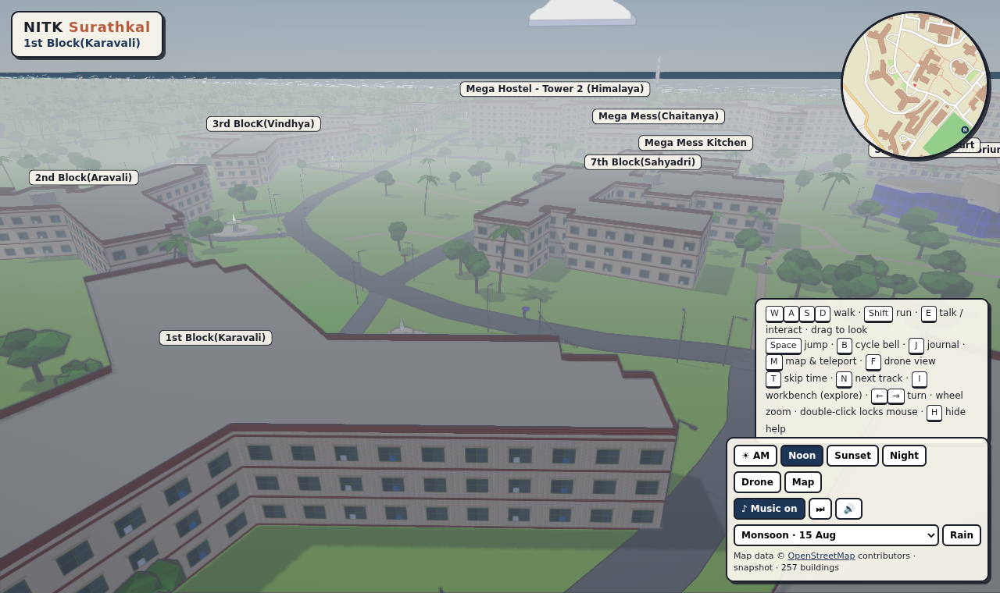 | 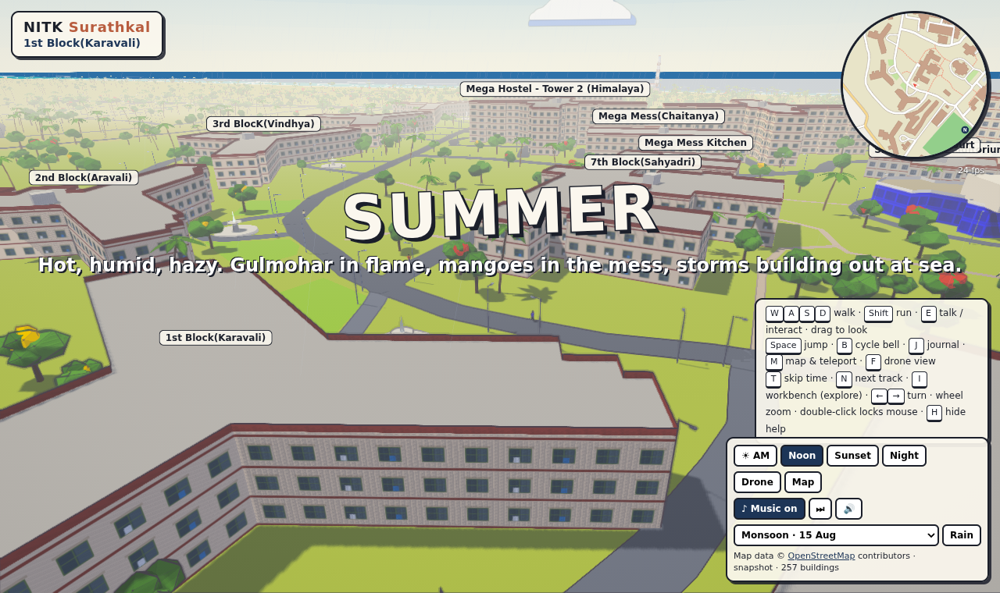 |
| 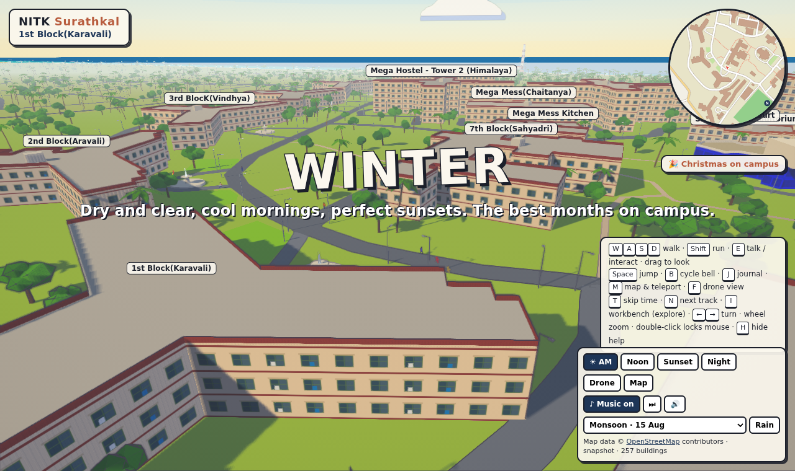 | 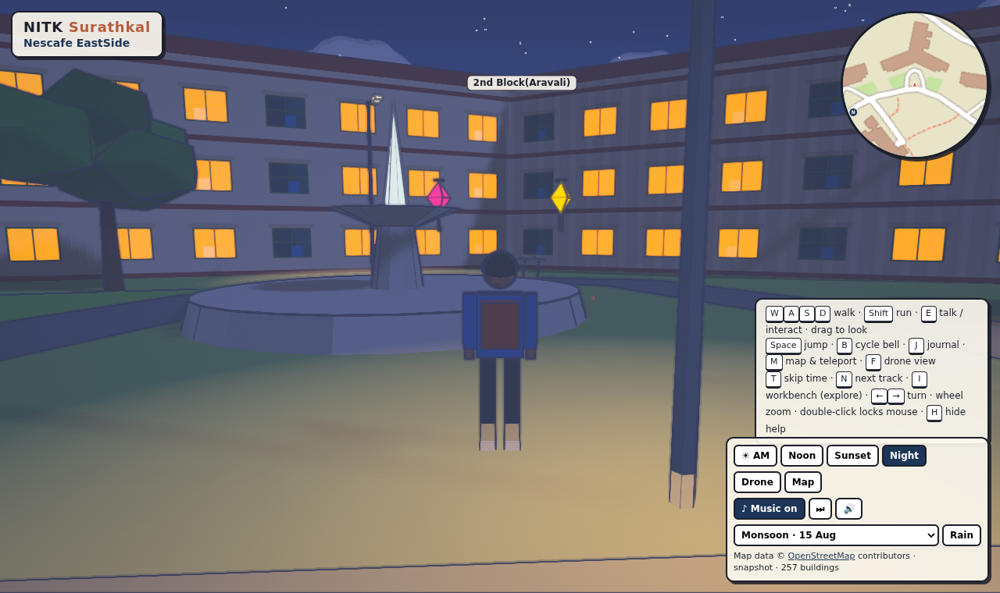 |

## Sound

Everything is synthesized in the browser; there are no audio files to download.

- **Music:** seven tracks that follow the moment and crossfade as it changes:
  - *Srinivasnagar* (the main theme)
  - *Campus Days* (lo-fi)
  - *Coastal Groove* (tabla theka and bansuri over a Mohanam drone)
  - *Monsoon* (rain)
  - *Lighthouse Hill* (sunset)
  - *Night Canteen* (night)
  - *Against the Clock* (timed missions and chases)

  N or Next skips a track, Music toggles it, and Mix opens separate volume controls for master, music, effects and ambience. Add your own MP3s in `public/music/` (see [Music](#adding-music)).
- **Ambience:** mixed from where you are and when:
  - waves loudest on the real coastline
  - NH66 traffic rumble and horns
  - birds, busiest at dawn and dusk; crickets at night
  - frogs on monsoon nights, cicadas on summer afternoons, thunder in storm season
  - student chatter around the hangouts
  - temple bells at dawn and dusk near the Sadashiva temple
  - wind and monsoon rain
  - footsteps that change on tarmac and in the wet, and the tick of your cycle's freewheel

## Where the campus comes from

The OpenStreetMap extract **ships with the game** as `public/data/nitk-osm.json` (about 0.5 MB), so nothing is downloaded from OpenStreetMap at start-up.

- **Refreshing it.** The GitHub workflow `.github/workflows/osm-snapshot.yml` fetches the extract from Overpass and commits the snapshot. Run it from the Actions tab (or change `src/area.json`), or run `npm run osm:fetch` locally.
- **If the snapshot is missing,** the game falls back to `src/data/fallback.ts`. That's a hand-approximated layout, traced from an OSM render centred on 13.009497, 74.795319 at zoom 17.
- **`?source=live`** fetches fresh data from Overpass (for checking new OSM edits). **`?source=fallback`** forces the approximate layout.

The map square is set in `src/area.json`: 13.0005–13.0205 N, 74.7815–74.8060 E. It covers the whole campus on both sides of NH66, the beach and the lighthouse.

## The game

Chapters 1 and 2 are playable. You're a first-year **B.Tech Computer Science & Engineering** student, section S7. Mission details come from NITK's own sites (nitk.ac.in, IRIS, WebClub) and its virtual tour.

Chapter 1, **Srinivasnagar**, follows the real first-year order: reporting, the induction programme, then classes. The monsoon.

| Mission | Giver, hours | What happens |
|---|---|---|
| **Main Gate** | automatic | Off the bus on NH66, your ID card and CSE section from the Academic Section, find Karavali (1st Block) |
| **Three Messes** | Rohan | Pick 1st block veg, 2nd block non-veg, or race 90 s for the last seats at Sahyadri |
| **Wheels** | Vikram | Buy his roadster for ₹300, or rush his lab record to LHC in 3 minutes |
| **Log in to IRIS** | Ananya, 9 AM – 5:30 PM | The password minigame; IRIS's real modules and history; your Semester I registration |
| **Induction Week** | Prakash, 7 – 10 AM | SJA: the Director and the anti-ragging committee, then a heritage walk (KREC 1960, the CCC 1995, the 2018 buildings, Friday films at SAC) and a quiz |
| **Saturday Parade** | Divya (NCC), weekends 6 – 9 AM | 2 Kar Engr Coy's enrolment parade on the Main Ground; drill words of command |
| **Library Card** | Mrs. Pai, 9 AM – 8 PM | Find K&R, a Chemistry text and Timoshenko in the stacks without running |
| **Lab Kit** | Vikram, 9 AM – 7 PM | The Co-op on a ₹600 budget: lab coat, goggles, the allowed calculator |
| **Scholarship Form** | Mrs. Shetty, weekdays 10 AM – 2:30 PM | Lobby, SBI before 4, back before 5:30; never during her lunch |
| **Roll Call** | Prof. Hegde, weekdays 8 – 9:05 AM | The first WO110 lecture in LHC-C: a proxy for Rohan, or not; classes start |
| **Maggi in the Rain** | Rohan, 3 – 8 PM | The monsoon hits. Beat the shutters to Nescafe |
| **The Sunset Rule** | Prakash, 4:30 – 6:30 PM | The lighthouse hill before the sun hits the sea. Chapter finale |
| **Monsoon Fever** | Rohan, weekdays 9 AM – 5 PM | Walk him to the Health Care Centre before the OPD shuts; Dr. Hebbar's verdict |
| **The Reading Room** | Ravi, 6 – 10 PM, after 4 missions | Pick the block's extra daily (Deccan Herald, Udayavani, The Hindu); first word of Crescendo |

Chapter 2, **Recruitments**, is a few weeks later, in the post-monsoon. Club stalls stand in an arc in front of the Students' Activity Centre:

| Mission | Giver, hours | What happens |
|---|---|---|
| **Recruitment Week** | automatic | Visit the club stalls and sign up for three |
| **Come Back Next Year** | Ananya | Get politely rejected by IEEE, ACM, IE and IET |
| **Freshers Cup** | Phoenix captain, 4 – 7:30 PM | A penalty shootout on Main Ground 1, Karavali vs Aravali |
| **Flat Tyre** | Rohan | Chase Kiran from Aravali across campus |
| **sudo make me a coffee** | Sid (LUG), 6 – 11 PM | Fix Rohan's dual-boot Wi-Fi in a Linux terminal |
| **First Light** | Meera, 7:30 – 11 PM, no rain | Name constellations |
| **Ganapati Bappa** | Rohan, 4 – 6 PM | Garlands, modaks and serial lights for Karavali's Ganesh pandal before the 7 PM aarti |
| **Raga at SJA** | Aditi (SPICMACAY), 4 – 6:25 PM | A veena and mridangam concert; the listening Q&A |
| **Not Me But You** | Arjun (NSS), weekends 6 – 10 AM | The NSS/Rotaract clean-up on NITK Beach before the tide |
| **CP League** | Ananya (WebClub), 5 – 9 PM | The Algorithms SIG's STL and complexity session at a CCC lab PC |
| **Night Canteen Run** | Raju anna, 9 – 10:45 PM | Three hot orders to three blocks in four minutes |
| **Quiz Night** | Farhan (LSD), 6 – 9 PM | The open quiz prelims in LHC-D: KREC, NH66, Engineer, Incident, Crescendo |
| **Wright Flight** | Keerthi (FARC), 4 – 6:30 PM, no rain | Build a balsa glider, two throws on the Main Ground; the sea breeze helps |
| **Expose** | Arnav (Photography), 4:30 – 6 PM, no rain | Four golden-hour frames before the light goes, for the SAC foyer wall |
| **Pitch Deck** | Vikram, weekdays 10 AM – 5 PM, after 4 missions | Incub8 at NITK-STEP: one idea, three judges' questions, ₹500 seed money |
| **Underpass** | Isha (Artists' Forum), weekends 7 – 11 AM, no rain | Paint from the Co-op, a mural on the NH66 underpass to the beach |
| **Musical Night** | Dev (Music Club), 5 – 7 PM, after 3 missions | Roadie the amp, drums and mic stands from SJA to the SAC stage by 7:30 |

### Campus jobs

Like Bully's odd jobs: small paid errands, once a day each, in their hours. They never complete; the journal lists them with **Open**, **Later**, **Done** or **Locked**.

| Job | Giver, hours | Pay | What happens |
|---|---|---|---|
| **News Wagon** | Nikhil (Press Club), weekdays 7 – 8:45 AM | ₹80 | Pin the wall magazine on four notice boards before class |
| **Xerox Run** | Manju, 3 – 7 PM | ₹120 | Notes from LHC-C to the xerox counter, copies to all three blocks, in four minutes |
| **Puncture Repair** | Babu, 8 AM – 8 PM | ₹60 + tips | Three flats: patch a thorn, pump a leaky valve |
| **Mess Supply** | Mr. Kotian, 6 – 8:30 AM | ₹90 + breakfast | Two vegetable crates from the Main Gate to the Mega Mess kitchen |
| **Library Shelving** | Mrs. Pai, 3 – 7 PM | ₹70 | Four returns back on the shelves; three shushes and you're out |
| **Friday Films** | Tanvi (Films Club), Fridays 5:30 – 7 PM | ₹100 | Projector from SJA, set up the Friday screening at SAC |

### Courses

Your Semester I courses are NITK's real CSE plan. Turn up in the room when one is on and press E; each is its own minigame, and passing levels it up (to 5) and unlocks a perk, as in Bully:

| Course | Room | Minigame | Perks |
|---|---|---|---|
| **CS110** C Programming | LHC-C | trace the output of C snippets | extra terminal time; seniors pay you to debug |
| **CS111** C Programming Lab | Central Computer Centre | click the buggy line | extra terminal time; money fixing lab PCs |
| **MA110** Engineering Mathematics I | LHC-D | a timed mental-maths sprint | energy and hunger drain slower |
| **CY110** Chemistry | LHC-D | quiz | food fills you more |
| **CY111** Chemistry Lab | Science Block | a titration: stop at the first faint pink | food fills you more |
| **WO110** Engineering Mechanics | LHC-C | forces and moments quiz | a faster cycle |
| **CV110** Environmental Studies | LHC-C | the Karnataka coast and environment | Clubs respect |

The journal lists your courses, levels, perks and the timetable.

### Journal and yearbook

- **Journal (J):** the day at a glance (date, time, season, money, attendance), respect with each hostel and group in its colour, clubs, and every mission and campus job with its icon, state and hours.
- **Yearbook (Y, or from the journal):** everyone in the cast, grouped into friends and seniors, clubs, faculty and staff, and around campus. Each person unlocks when you walk up to them or they speak to you, and gets a portrait rendered from their own 3D model. Until then they are a silhouette with a hint of where to find them.

The Bully-style systems:

- **Missions and markers:** yellow "!" mission givers, a waypoint beam, an objective tracker with timers, and big MISSION PASSED / FAILED banners.
- **Time and stats:** a game clock (one game minute per real second) with a daily routine, plus Energy, Food, ₹ and Attendance.
- **Classes:** see Courses above. Missing them drops your attendance; under 75% and IRIS tells your HoD.
- **Daily life:**
  - meals at your mess at meal times
  - Maggi at Nescafe, Oreo shakes at Nandini, and the night canteen
  - sleep, or rest an hour, at Karavali
- **Students:** about 180 walk the real footpaths, hang out in groups at Nescafe, Nandini, LHC and the mess, pop umbrellas in the rain, chatter in English, Hindi, Kannada and Tulu, and complain when you barge through them.
- **Cycles:** a few students ride the campus roads, racks stand outside the hostels, and you get your own roadster (E to ride, B for the bell).
- **Weather:** monsoon rain, with its own lighting and sound.
- **Journal (J):** your stats, respect with each group, the clubs you've joined, the Next Year list, and every mission by chapter.
- **Saving:** progress saves to your browser automatically. The title screen offers Continue or New game.

The research behind it (hostels, clubs, fests, lore) and the plan for later chapters are in [`docs/GAME_BIBLE.md`](docs/GAME_BIBLE.md).

| | |
|---|---|
| 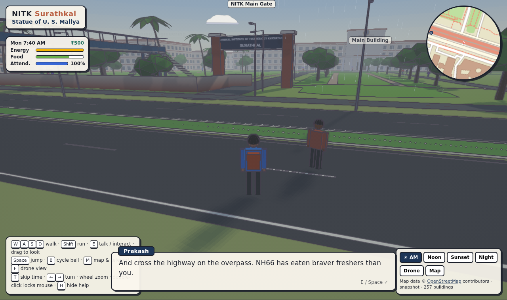 | 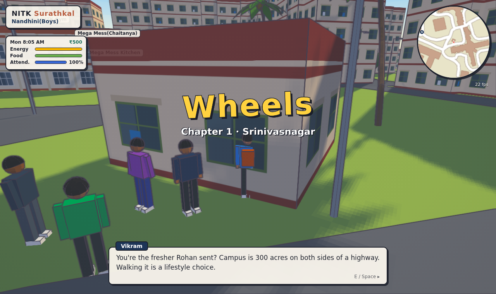 |
| 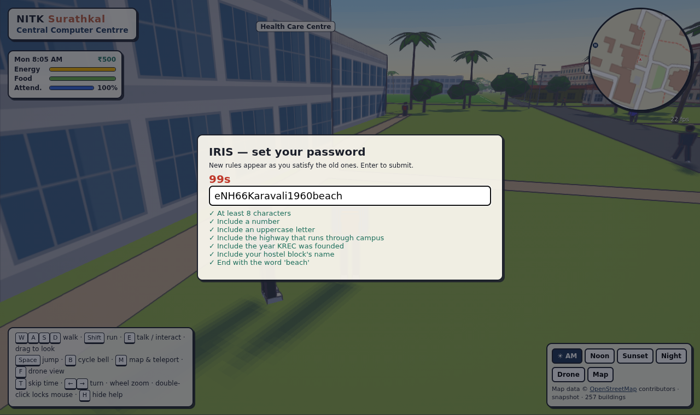 | 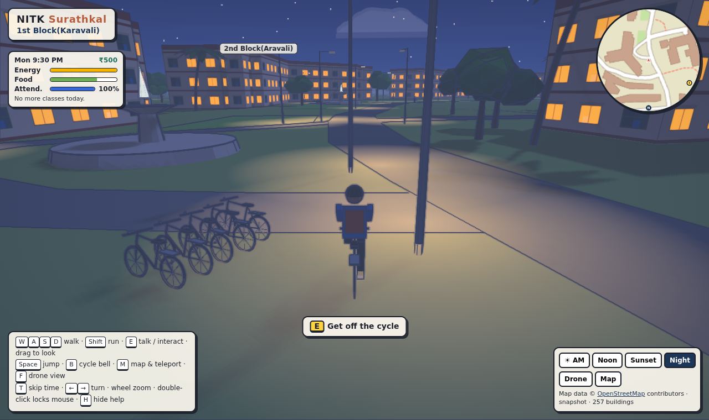 |
| 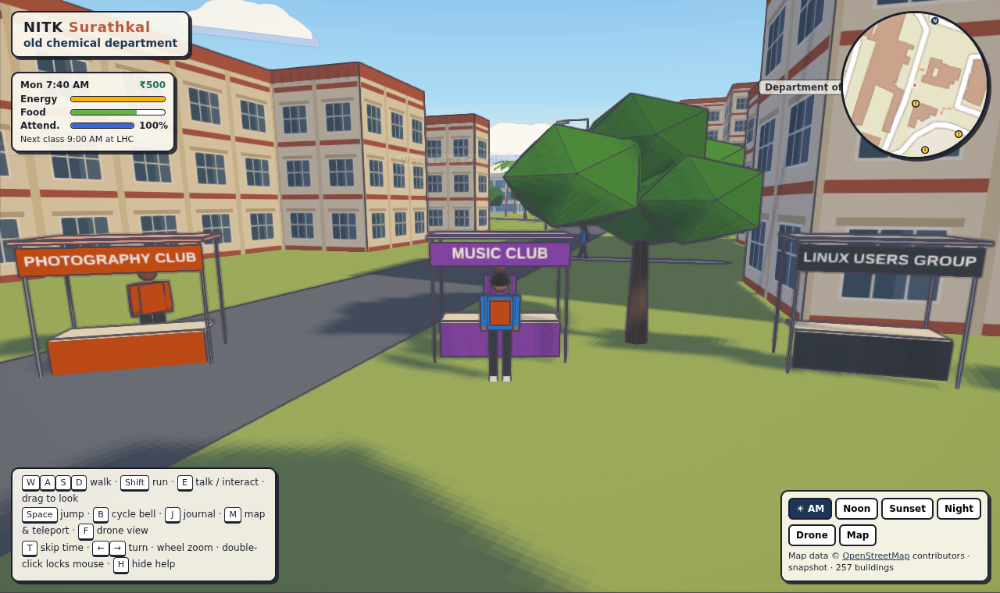 | 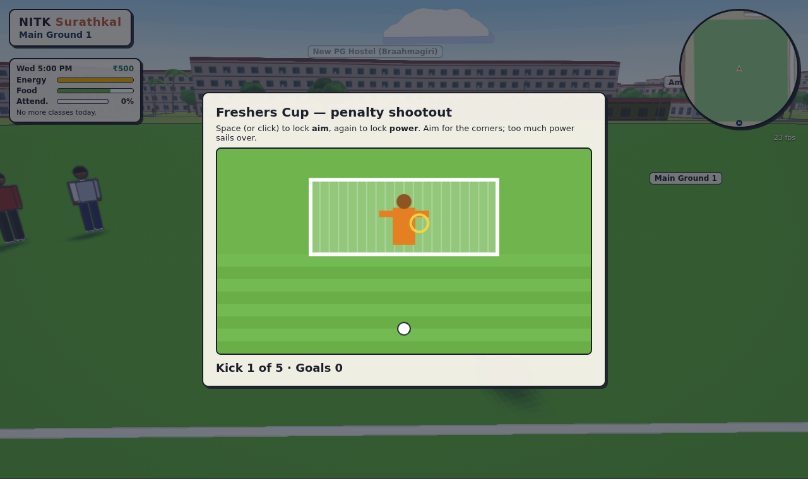 |
| 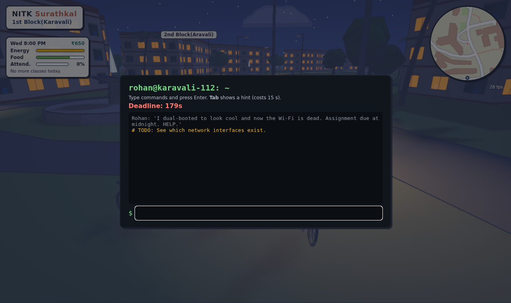 | 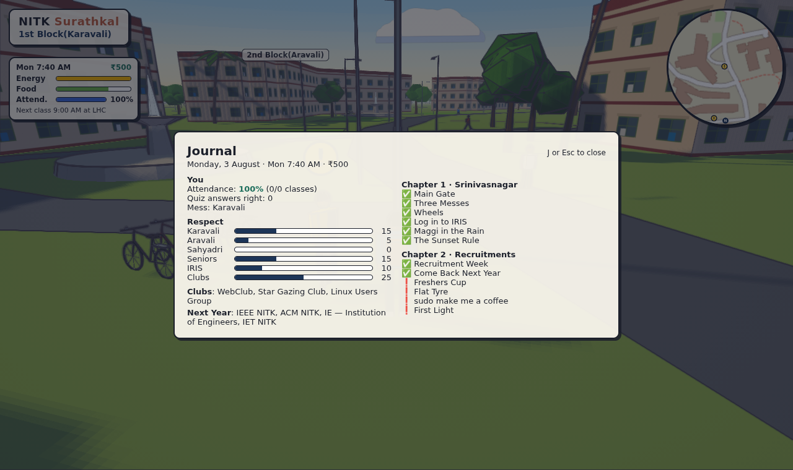 |

**Dev shortcuts:**
- `?autostart` skips the title screen.
- `?skipto=ch1-maggi` (any mission id) starts just before that mission.
- `?explore` goes straight into Explore mode.
- `window.nitk` exposes the game for debugging.

## What's in the world

- **OSM geometry, 1:1.** Every road (NH66 as a divided highway with a median), building footprint, landuse area, sports pitch, pool, barrier and mapped tree sits at its real position.
- **Buildings.** Heights come from `height` or `building:levels` when OSM has them, otherwise from sensible defaults. Façades are matched to photographs of the campus and NITK's [virtual tour](https://vtour.nitk.ac.in/) (`src/world/archetypes.ts`, by OSM name):
  - the Main Building and the old departments: khaki-yellow render with continuous concrete sunshade ledges over recessed windows; the Main Building's wings add vertical fins (an egg-crate front)
  - the old hostel blocks: khaki render, sunshade ledges, louvred windows; tiled roofs only where OSM says pitched
  - the Mega Hostel towers: tan frame, cream panels, small grilled windows, a blue-glass stair core
  - LHC-A: exposed laterite; the Library, LHC-D, CRF, CIDS and SJA: white render with lavender-grey bands
  - pastel houses with Mangalore-tile hip roofs and black rooftop water tanks, and shopfronts with rolling shutters off campus

  Windows light up at night.
- **Walk-in interiors.** Fitted out from the virtual tour's inside shots where it has them:
  - the Main Building lobby: square pillars with dark-wood capitals, teak wainscot, coloured-glass jali over the door, the "Think · Create · Engineer" display, enquiry desk, stair and office corridors
  - LHC-A: classrooms round the courtyard with maroon pad chairs, whiteboard and projector screen, ceiling fans, grilled windows
  - the Central Computer Centre, fitted like the Solve lab: workbenches with PCs and kits, maroon office chairs, glass partitions, blue posters, split ACs
  - Central Library (stacks, reading tables, issue desk), SJA (stage and seating), Mega Mess (steel tables, serving counter) and the Night Canteen
 Walk through the lit front door: the shell and roof cut away and the camera looks down into the room (`src/world/interiors.ts`).
- **Landmarks.** These are matched by OSM name or tag, so they land wherever the real map puts them:
  - the lighthouse on its knoll, with a sweeping beam after dusk
  - the Main Building's olive entrance block: glass front between four yellow piers, three yellow arches over the porch, the blue fountains in front
  - the main gate on NH66: stone piers, security cabin and the curved black-granite trilingual name wall; inside it, two yellow pavilions with terracotta roofs and a balustrade with yellow ball finials
  - the front lawns from the gate to the Main Building: red-brick walks, croton beds, Ashoka rows
  - the SAC amphitheatre: green tiers, red stair flights, lavender stage under a canopy on yellow poles
  - the U. Srinivas Mallya statue in the gate pavilion, and the institute's name in red on the NH66 frontage wall
  - the EEE/IT blocks and International Hostel in saturated yellow, with glass stair strips and a green portal porch
  - the grounds in bare laterite earth (the main grounds, the clay tennis court), grey concrete basketball courts with green-and-yellow seating, and floodlight masts on lit grounds and the pool
  - the square red-and-white lighthouse with its gallery, lantern and sweeping radar
  - Chemical Engineering's curved canopy
  - signage on the Central Library, SJA and Lecture Hall Complex
  - the fountain, the tricolour and water towers
- **Coast.** The sea polygon is built from the OSM coastline. It has cel-banded shallows, swell lines, breakers and a surf line on the real shore, with sand and a casuarina belt behind it.
- **Vegetation.** Coconut palms, broadleaf canopy and casuarinas, scattered by land use. On campus: columnar Ashoka trees, rain-tree avenues arching over the roads, and bare laterite soil in their shade.
- **Street furniture.** Black-and-white painted kerbs and white globe lamps on campus roads; compound walls with a laterite plinth, jali screen and pillars.
- **Time of day.** Morning, noon, Arabian-Sea sunset and night, with lit windows, street-lamp pools and stars.
- **HUD.** A rotating minimap, a full map, floating building labels, and a "you are near" banner.
- **Map (M).** Styled after SADAK's map: a dark vector map of the campus only, plus the beach and lighthouse hill, with NH66, its two underpasses and the foot overbridge as connectors. Buildings are tinted by kind. Places carry Lucide icons in their category colours (hand-drawn where Lucide has none: hostel, thali, sea, Yakshagana crown). There is a key you can filter by, street names when zoomed in, gold story and teal job markers, and an "Open now" list. Drag to pan, scroll to zoom, click to teleport.

## Controls

| | |
|---|---|
| `W A S D` | walk (`Shift` run, `Space` jump) |
| `E` | talk, interact, get on or off your cycle |
| `B` | cycle bell (students jump aside) |
| `J` | journal |
| `Y` | yearbook |
| `N` | next music track |
| drag / double-click | look around / lock the mouse |
| `←` `→` / wheel | turn / zoom |
| `M` | map, search and teleport |
| `F` | drone view (`Space` / `C` to climb or descend) |
| `T` | skip the clock ahead |
| `H` | hide help |

On touch screens, the left half of the screen is a joystick and the right half looks around.

## Layout

```
src/
  area.json          map square + Overpass mirrors
  osm/               query, loader, OSM -> CampusMap compiler (parse.ts)
  data/fallback.ts   offline approximation
  world/             ground & sea, roads, buildings, landmarks, trees, props, grid
  fx/                toon materials, cel/ink pass, sky, time-of-day presets
  player.ts          walker, cyclist, drone, camera
  ui/hud.ts          minimap, full map, labels, objective blips
  ui/mapKit.ts       map style, place kinds, the campus-only region
  ui/icons.ts        Lucide + hand-drawn icons, for HTML and canvas
  game/              the game: mission runner (index.ts), chapter1.ts, chapter2.ts, jobs.ts,
                     minigames, club stalls, journal, cast, crowd, cycles,
                     rain/beacon/bees, UI, save state,
                     audio (buses), music (sequencer + tracks), ambience
  game/seasons.ts    calendar, seasons, sun times, festivals, seasonal grading
  game/festivals.ts  festival decorations
  world/archetypes.ts per-building looks matched to photos
  world/interiors.ts walk-in ground floors and the cutaway
  world/overrides.ts per-building overrides (public/data/overrides.json)
  world/models.ts    custom .glb models on OSM footprints
scripts/fetch-osm.mjs  snapshot the extract into public/data (also run by CI)
```

## Working on the campus

Best first:

1. **Improve OpenStreetMap.** Add `building:levels` (or `height`), `roof:shape`, `roof:colour`, `building:colour` and `name`, then refresh the snapshot (`npm run osm:fetch`, or the **OSM snapshot** workflow in GitHub Actions).
2. **Match a building to photos** in `src/world/archetypes.ts` (façade style, wall colour, roof), or add hero details in `src/world/landmarks.ts`.
3. **Overrides** for what OSM shouldn't hold: `public/data/overrides.json`, keyed by OSM id, wins over everything else.

   ```json
   { "version": 1, "buildings": { "way/361006764": { "levels": 4, "colour": "#ecdfae", "style": "academic", "roofShape": "flat" } } }
   ```

   Fields: `name`, `levels`, `height`, `minHeight`, `style` (`academic`, `hostel`, `megahostel`, `laterite`, `modern`, `house`, `shop`, `plain`, `industrial`), `colour`, `roofShape`, `roofColour`, `hidden`, `model`, `note`.
4. **Custom models:** put a `.glb` in `public/models/` and reference it from the override (`"model": { "url": "models/main.glb", "scale": 1, "rotation": 0 }`). Metres, Y up, origin at the footprint centre on the ground, long side along +X. Materials are converted to cel shading, so keep them to a base colour and texture.

To add a walk-in building, add its OSM name and a room kind to `ROOMS` in `src/world/interiors.ts`.

### Adding music

Drop tracks into `public/music/` and list them in `public/music/manifest.json`:

```json
[{ "title": "Lighthouse Blues", "file": "lighthouse.mp3", "moods": ["sunset", "day"] }]
```

Moods: `title`, `day`, `rain`, `sunset`, `night`, `mission`.

## Credits

Map data © [OpenStreetMap](https://www.openstreetmap.org/copyright) contributors, ODbL 1.0.

The cel pipeline (toon ramp patch, ink/grade pass, painted sky) is ported from SADAK. SADAK adapted it from [sakura-crossing](https://github.com/Kenton-GMI/sakura-crossing), MIT License, © 2026 Kenton Wang.
